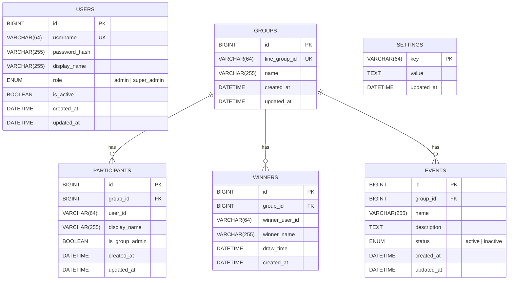

# 2. Database Schema & ER Diagram

## ER Diagram (Mermaid — render บน GitHub)



## ตารางทั้งหมด

### `users` — บัญชี Admin (JWT Auth)

| Column | Type | Constraints | คำอธิบาย |
|---|---|---|---|
| id | BIGINT UNSIGNED | PK, AUTO_INCREMENT | |
| username | VARCHAR(64) | UNIQUE, NOT NULL | ชื่อผู้ใช้ |
| password_hash | VARCHAR(255) | NOT NULL | bcrypt hash |
| display_name | VARCHAR(255) | NOT NULL | ชื่อแสดง |
| role | ENUM('admin','super_admin') | NOT NULL, DEFAULT 'admin' | RBAC |
| is_active | TINYINT(1) | NOT NULL, DEFAULT 1 | เปิด/ปิดบัญชี |
| created_at / updated_at | DATETIME | | |

### `groups` — LINE Groups

| Column | Type | Constraints | คำอธิบาย |
|---|---|---|---|
| id | BIGINT UNSIGNED | PK | |
| line_group_id | VARCHAR(64) | **UNIQUE**, NOT NULL | `source.groupId` จาก LINE webhook |
| name | VARCHAR(255) | NOT NULL DEFAULT '' | ชื่อกลุ่ม (sync จาก LINE API) |

### `participants` — ผู้เข้าร่วม

| Column | Type | Constraints | คำอธิบาย |
|---|---|---|---|
| id | BIGINT UNSIGNED | PK | |
| group_id | BIGINT UNSIGNED | **FK → groups.id**, ON DELETE CASCADE | |
| user_id | VARCHAR(64) | NOT NULL | LINE userId |
| display_name | VARCHAR(255) | NOT NULL | ชื่อจาก LINE Profile |
| is_group_admin | TINYINT(1) | DEFAULT 0 | ผู้สมัครคนแรกของกลุ่ม = ผู้ดูแล |

**Indexes:**
- `UNIQUE (group_id, user_id)` — **ป้องกันสมัครซ้ำ** (หัวใจของระบบ)
- `(group_id)` — query รายชื่อ/สุ่มเร็ว
- `(user_id)` — ค้นหาสมาชิก

### `winners` — ประวัติผู้โชคดี

| Column | Type | Constraints | คำอธิบาย |
|---|---|---|---|
| id | BIGINT UNSIGNED | PK | |
| group_id | BIGINT UNSIGNED | **FK → groups.id**, ON DELETE CASCADE | |
| winner_user_id | VARCHAR(64) | NOT NULL | |
| winner_name | VARCHAR(255) | NOT NULL | snapshot ชื่อตอนชนะ |
| draw_time | DATETIME | NOT NULL | เวลาสุ่ม |

**Indexes:**
- `(group_id, draw_time)` — ประวัติรายกลุ่ม เรียงตามเวลา
- `(winner_name)` — ค้นหาผู้ชนะ

### `events` — กิจกรรม (Dashboard นับจำนวนกิจกรรม)

| Column | Type | Constraints | คำอธิบาย |
|---|---|---|---|
| id | BIGINT UNSIGNED | PK | |
| group_id | BIGINT UNSIGNED | **FK → groups.id**, ON DELETE CASCADE | |
| name | VARCHAR(255) | NOT NULL | ชื่อกิจกรรม |
| description | TEXT | NULL | |
| status | ENUM('active','inactive') | DEFAULT 'active' | |

### `settings` — ระบบ Key/Value

| Column | Type | Constraints |
|---|---|---|
| key | VARCHAR(64) | **PK** |
| value | TEXT | NULL |
| updated_at | DATETIME | |

ค่าเริ่มต้น:

| key | default | ความหมาย |
|---|---|---|
| wheel_enabled | `true` | เปิด/ปิดการจับสลาก |
| spin_requires_admin | `true` | เฉพาะผู้ดูแลกลุ่มหมุนได้ |
| winners_can_repeat | `true` | ผู้ชนะแล้วชนะซ้ำได้ไหม |
| list_max_lines | `40` | จำนวนรายชื่อที่แสดงใน LINE |

## Relationships สรุป

```
groups 1 ──── N participants   (ON DELETE CASCADE)
groups 1 ──── N winners        (ON DELETE CASCADE)
groups 1 ──── N events         (ON DELETE CASCADE)
users  (อิสระ ไม่มี FK — บัญชี admin)
settings (อิสระ)
```

> Schema ถูกสร้างอัตโนมัติโดย `sequelize.sync()` ตอน backend เริ่มทำงาน
> และมี `database/init.sql` ให้ Docker รันครั้งแรก (idempotent — `IF NOT EXISTS`)
